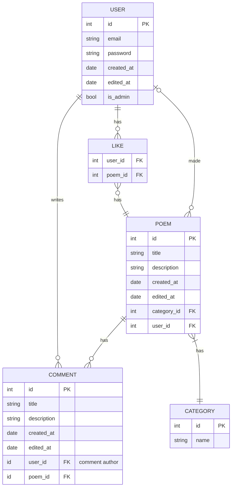
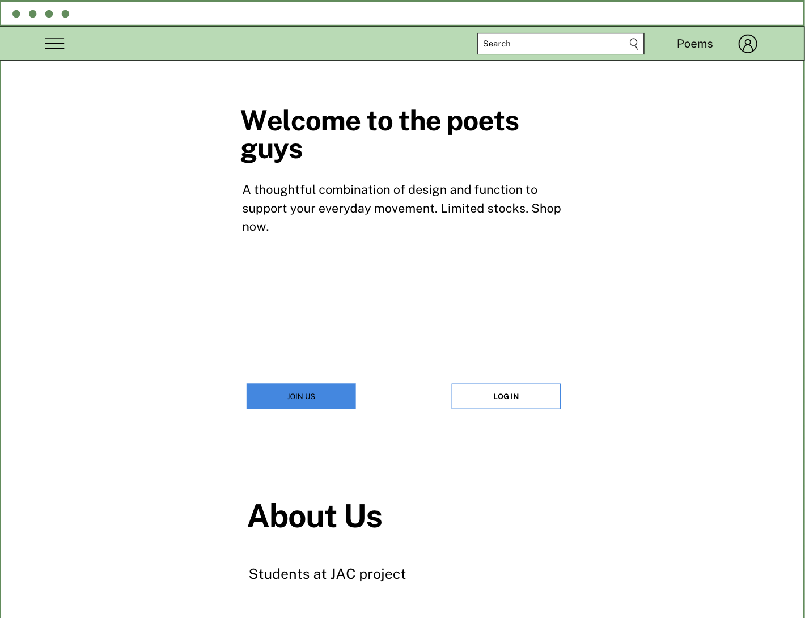
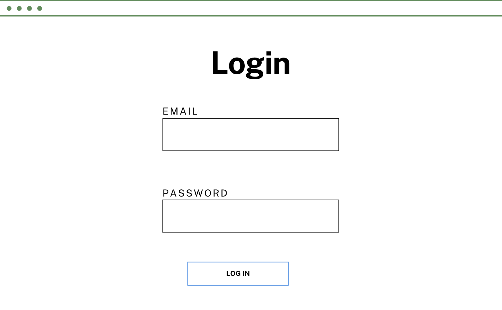
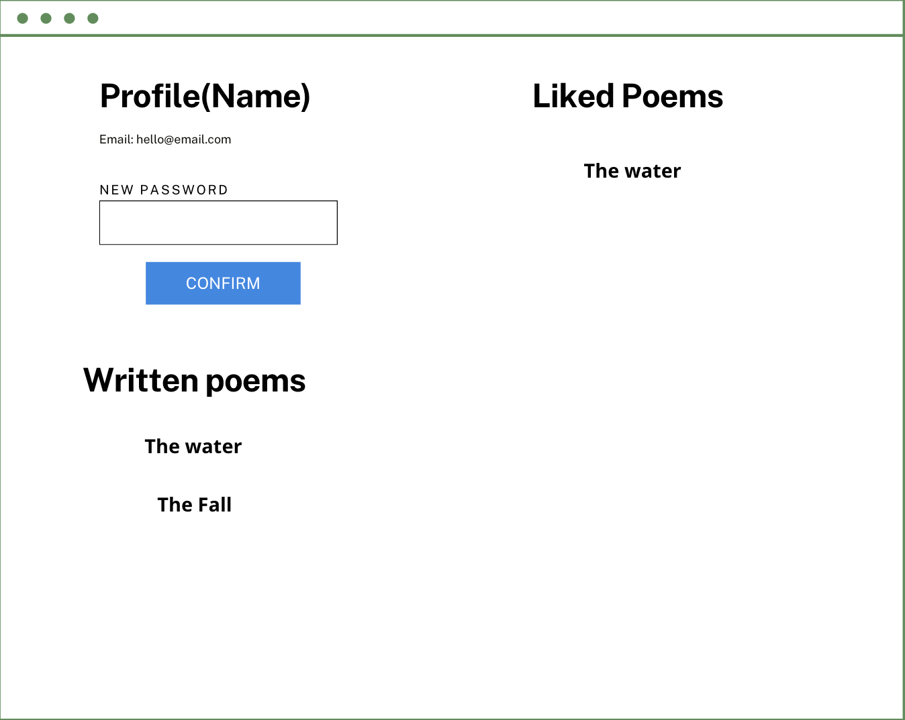
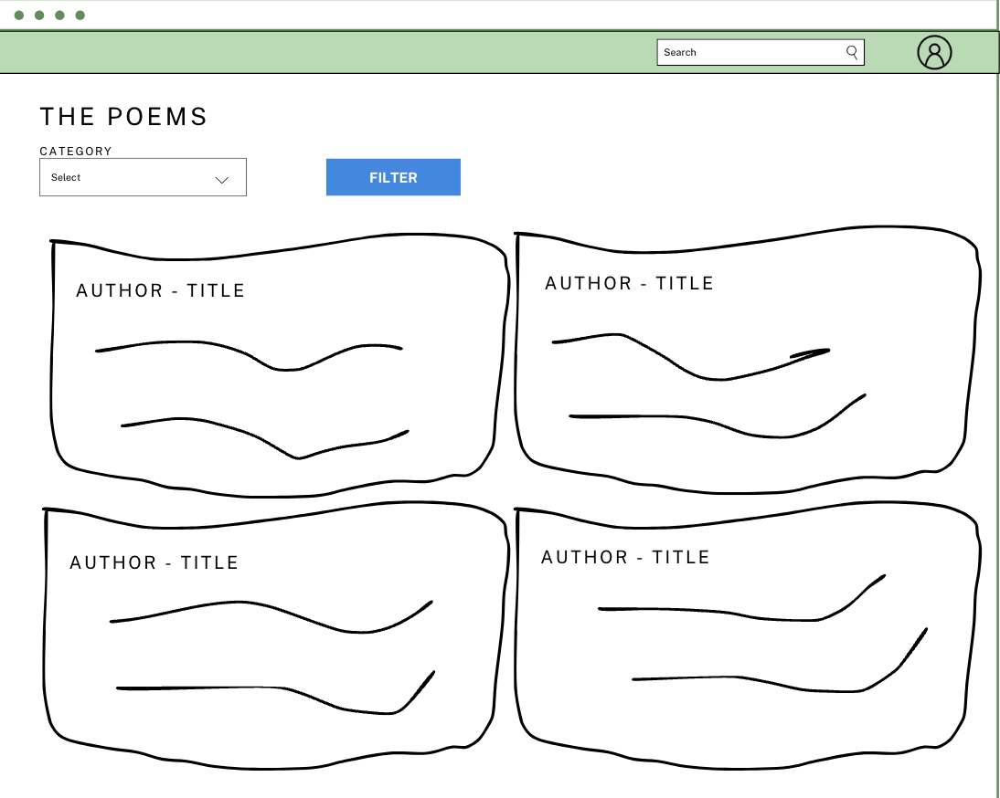
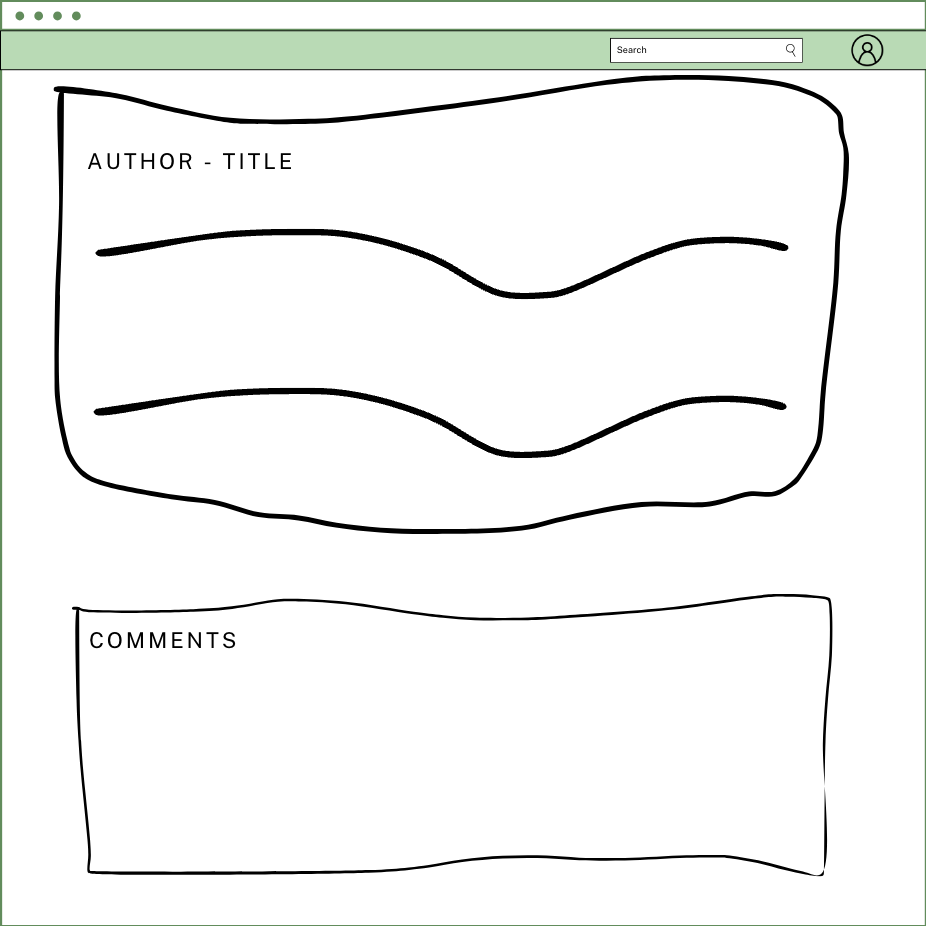
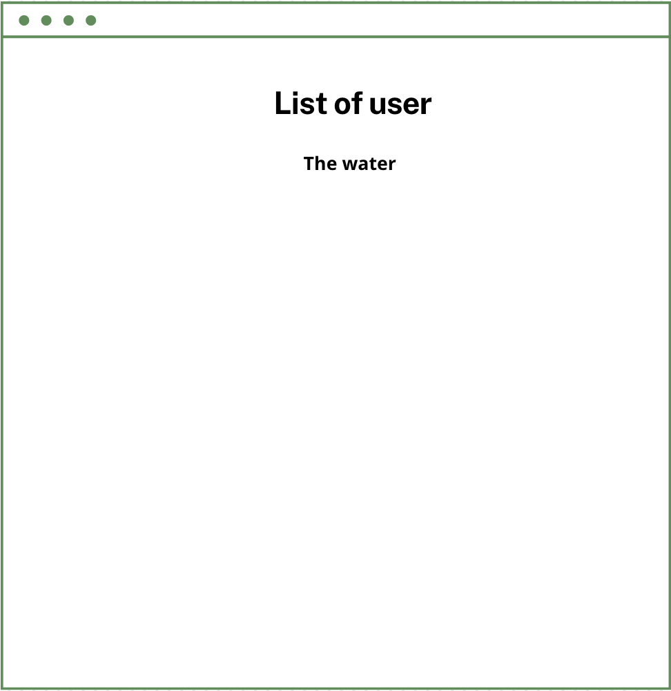

Introducing "Les Poets Guys" – a platform where anyone can post and share their poems and and enjoy the benefit of reading poetry. This app is for:

-   Every person that loves poetry.
-   Someone who wants to organise their poems in a easier way.
-   Some one that wants to share their feeling and thoughts to the world.

## 🧱 Core Functionality

-   **Poem Creation:** Users can create a poem with a title and the description.
-   **User Management:** Users must sign in to be able to create a poem and leave a comment.
-   **In-Poem Review:** Simple comment threads attached to poem opinions.
-   **Like Poem:** Users can give a like to a peom and view their liked poems.
 
### Requirements

#### Poem Stories

-   As a user, I want to create a poem so that I can show other users what I have done.
-   As a user, I want to view other people's poems in a list so I can see what every did.
-   As a user, I want to edit my poem to update its details.
-   As a user, I want to delete a poem when it's no longer relevant.

#### User Management Stories

-   As a user, I want to register for an account so I can start using the app.
-   As a user, I want to log in to my account to access my poems.
-   As a user, I want to log out of my account to securely end my session.

#### Admin Management Stories
-  As an admin, I want to be able to modify and delete any comment on the website.
-  As an admin, I want to be able to modify and delete any poem on the website.
-  As an admin, I want to be able to modify and delete any user on the website.

#### Comment Stories

-   As a user, I want to leave a comment on a poem to provide my opinion on it.
-   As a user, I want to see comments from other members that use the app.
-   As a user, I want to be notified if there's a new comment on a task I'm involved with.

#### Category Stories

-   As a user, I want to be able to assign a category to my poem so that I know the type of poem.
-   As a user, I want to change the category of my poem if it doesn't belong to that genre.
-   As a user, I want to see the category next to each poem in the list so that I know that type of poem.

#### Like Stories
-   As a user, I want to be able to give a like to a poem so that I can show that I love the poem.
-   AS a user, I want to see my liked poems in my user profile page.

## ᛦ Entity Relationships

-   **Authentication System:** Handling user registration, login, logout, and session management.
-   **Poem Management:** Logic for poem creation and CRUD operations on poems.
    **Category Management** Logic for assigning category to a poem.
-   **UI Elements:** Design of forms, poem lists, poem overview, comment list.

## 📍 API Routes

### Project Management

| Request              | Action                           | Response              | Description                                                             |
| -------------------- | -------------------------------- | --------------------- | ----------------------------------------------------------------------- |
| POST /poems       | PoemController::createPoem | 201 /poems/:id     | Create a new poem and redirect to the poem view                 |
| GET /poems/:id    | PoemController::getPoem    | 200 PoemDetailView | Retrieve details of a specific poem                                   |
| GET /poems        | PoemController::getListPoem| 200 ListPoemView   | Retrives all poems with their title and category
| PUT /poems/:id    | PoemController::updatePoem | 200 /poems/:id | Update an existing poems information                                |
| DELETE /poems/:id | PoemController::deletePoem | 204 /poems      | Delete a poem |
| POST /poems       | PoemController::createPoem | 403 /poems/:id     | Forbidden, need to be logged in                 |
| PUT /poems/:id       | PoemController::updatePoem | 403 /poems/:id     | Forbidden, need to be logged in                 |
| DELETE /poems/:id       | PoemController::deletePoem | 403 /poems/:id     | Forbidden, need to be logged in                 |
| PUT /poems/:id       | PoemController::updatePoem | 403 /poems/:id     | Unauthorized, only admin or owner can modify                 |
| DELETE /poems/:id       | PoemController::deletePoem | 403 /poems/:id     | Unauthorized, only admin or owner can delete                 |

### Comment Management ###
| Request              | Action                           | Response              | Description                                                             |
| -------------------- | -------------------------------- | --------------------- | ----------------------------------------------------------------------- |
| POST /poems/:id/comments       | CommentController::createComment | 201 /poems/:id     | Create a new comment and redirect to the comment list of that poem                 |
| GET /poems/:id/comments         | CommentController::getListComment| 200 PoemView   | Retrives all comments of that poem                              |
| PUT /poems/:id/comments/:id    | CommentController::updateComment | 200 /poems/:id | Update an existing comment information                                |
| DELETE /poems/:id/comments/:id | CommentController::deleteComment | 204 /poems      | Delete a comment |
| POST /poems/:id/comments       | CommentController::createComment | 403 /poems/:id     | Forbidden, must be logged in                 |
| PUT /poems/:id/comments/:id       | CommentController::updateComment | 403 /poems/:id     | Forbidden, must be logged in                 |
| DELETE /poems/:id/comments/:id       | CommentController::deleteComment | 403 /poems/:id     | Forbidden, must be logged in                |
| PUT /poems/:id/comments/:id       | CommentController::updateComment | 401 /poems/:id     | Unauthorized, only admin or owner can modify                |
| DELETE /poems/:id/comments/:id       | CommentController::deleteComment | 401 /poems/:id     | Unauthorized, only admin or owner can delete                 |

### User Management ###
| Request              | Action                           | Response              | Description                                                             |
| -------------------- | -------------------------------- | --------------------- | ----------------------------------------------------------------------- |
| POST /users/register       | UserController::createUser | 201 /poems/login     | Create a new user                  |
| POST /users/login       | AuthController::login | 200 /poems/     | Login the user to the page                 |
| POST /users/logout       | AuthController::logout | 200 /     | Logout the user from the page                 |
| PUT /users/:id    | UserController::updateUser | 200 /poems | Update an existing user's information                                |
| PUT /users/:id    | UserController::updateUser | 403 /poems | Unauthorized, only admin or owner can modify                               |

### Admin Management ###
| Request              | Action                           | Response              | Description                                                             |
| -------------------- | -------------------------------- | --------------------- | ----------------------------------------------------------------------- |
| DELETE /users/:id    | UserController::deleteUser | 200 /users | Admin can delete user                               |
| PUT /users/:id    | UserController::toggleAdmin | 200 /users | Admin makes another user admin                              |
| DELETE /users/:id    | UserController::deleteUser | 403 /users | Unauthorized, only admin can delete user                              |
| PUT /users/:id    | UserController::toggleAdmin | 403 /users | Unauthorized, only admin can delete user                             |

## 📐 Wireframes

The home view is the home page where the user is shown some definitions and examples of poems.

The login view is the initial screen where users can enter their credentials to log into their account. It typically consists of a form with input fields for the username/email and password, along with a "Login" button. The login view should also include a link to the registration page for new users who don't have an account yet.

The profile view is e the user can view their information and modify their email or password and cna see their liked poems.

All the poems for the logged in user where they can sort by title, and created date. If they want a more detailed view, can click on one of the poems (see next view).

This view shows the user more details for one specific poem. There is a created date, a description field of the poem, edit the task, or delete if the user created that poem. At the bottom, there is also a list of comments associated with the poem and a box to leave a comment.

This view shows all users in the platform and the admin can delete the user of make them admin.
